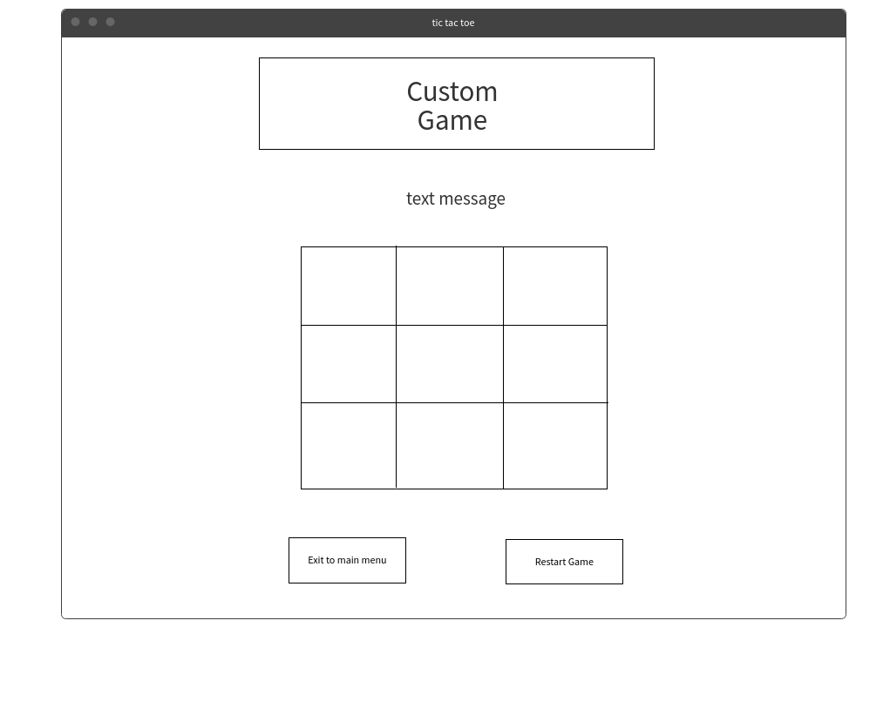

# Tic Tac toe

### Introduction:

This Project about tic tac toe game two player start engaging and its simple game.

### Getting Started:

Start game by click start game on the index.html then will go to game.html and start game. read How to play section.

### How to Play:

Start by Player One with letter X and Player Two with letter O.
Then, start game with by clicking in square spot starting with Player One.

### Restart Game:

You have button starting game anytime during game to start new game or if game tie. if click restart game buttone will clear all spot and go back to first move with player one.

### Features: 

- Style Css Hover.
- Button Restart Game
- Players can change color background
- Players can change color of X or O

### Demo:
URL:  https://pages.git.generalassemb.ly/ghassansaud/project-1/

### Technical used:

- Html
- Css 
- JavaScript & JQuery

### Wireframe:

### Features in future:
- multiple game rounds with a win counter.
- let Player choose X or O
- Upgrade Custome game with some idea.
- Add audio to the game.
